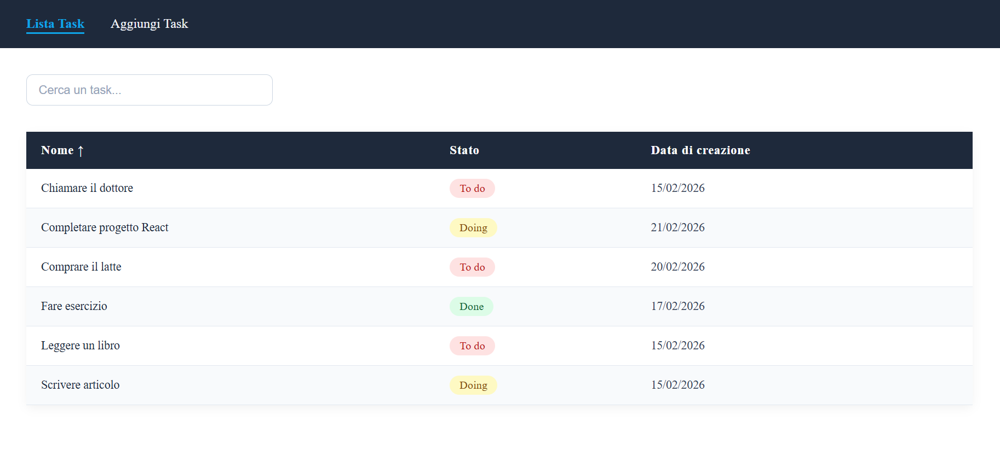
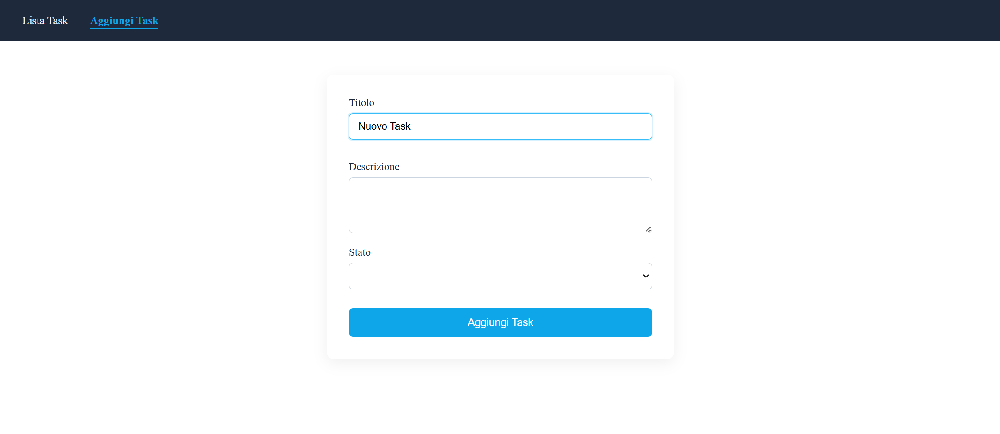
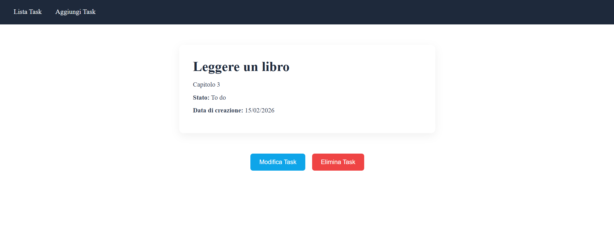
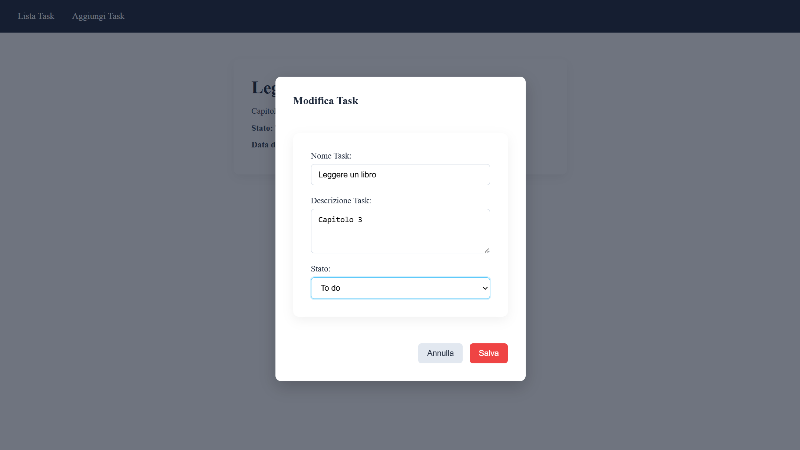
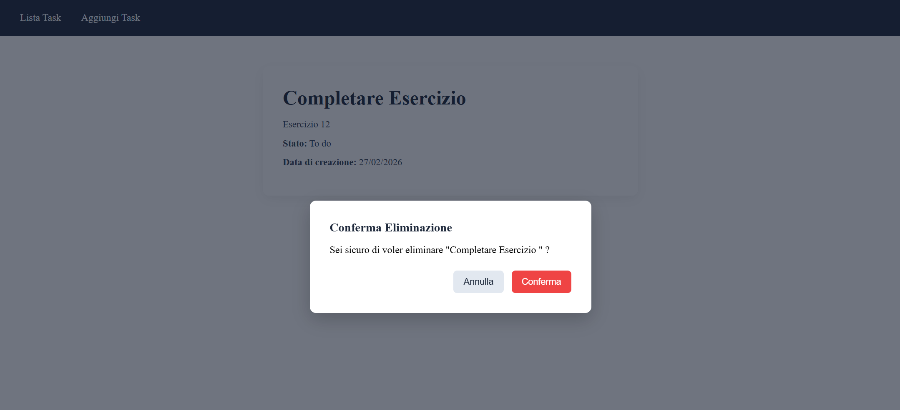

<p align="center">
  
</p>

<h1 align="center">EX – Task Manager Avanzato (React)</h1>

Applicazione sviluppata con **React + Vite** che simula un Task Manager completo con gestione CRUD, ottimizzazioni delle performance e miglioramenti UX.

Il progetto è strutturato per consolidare concetti avanzati come:

- Context API
- Custom Hook
- Ottimizzazione con `useMemo`
- Memoizzazione con `React.memo`
- Debounce con `useCallback`
- Gestione modali con `createPortal`

---

## Anteprima

### Lista Task


---

### Aggiunta Task


---

### Dettaglio Task


---

### Modifica Task (Modal)


---

### Elimina Task (Modal)


---

## Obiettivo dell’esercizio

Costruire un'applicazione per la gestione dei task che permetta di:

- Creare nuovi task
- Modificare task esistenti
- Eliminare task con conferma
- Visualizzare i dettagli
- Ordinare e filtrare dinamicamente
- Ottimizzare il rendering

---
## Funzionalità Implementate

### 📌 Gestione Task (CRUD)

- Recupero task da API (`GET`)
- Creazione task (`POST`)
- Modifica task (`PUT`)
- Eliminazione task (`DELETE`)
- Stato globale gestito con **Context API**
- Logica centralizzata in un **custom hook `useTasks()`**

---

### 📌 Lista Task

- Visualizzazione in tabella
- Status colorato dinamicamente
- Ottimizzazione con `React.memo`
- Ordinamento per:
  - Nome
  - Stato
  - Data di creazione
- Indicatore visivo ↑ ↓ sulla colonna attiva

---

### 📌 Ricerca Ottimizzata

- Filtro case-insensitive per nome
- Debounce con `setTimeout`
- Memoizzazione della funzione con `useCallback`
- Ottimizzazione del ricalcolo con `useMemo`

---

### 📌 Modali Riutilizzabili

- Componente `Modal` generico con `createPortal`
- Conferma eliminazione task
- Modale di modifica con form controllato
- Submit attivato tramite `useRef`

---

## Tecnologie Utilizzate

- React
- Vite
- Postman (test chiamate API)
- CSS

---

## 🚀 Avvio del Progetto

### Backend

```bash
git clone https://github.com/boolean-it/react-task-manager-back
npm install
npm run start