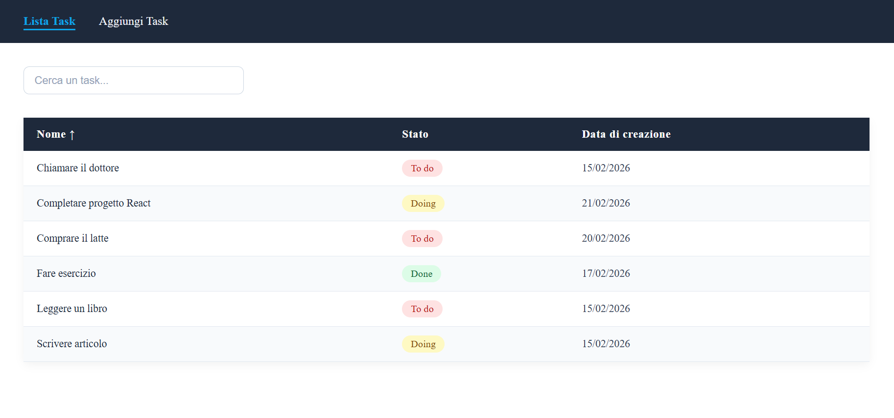
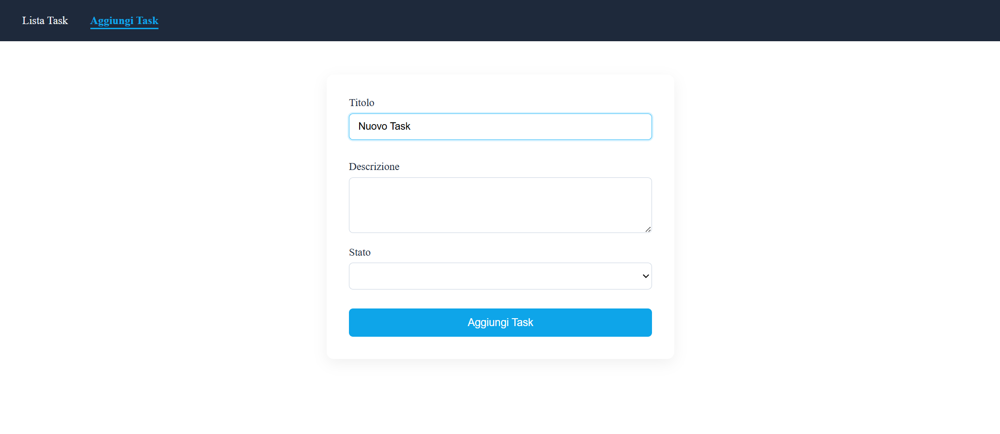
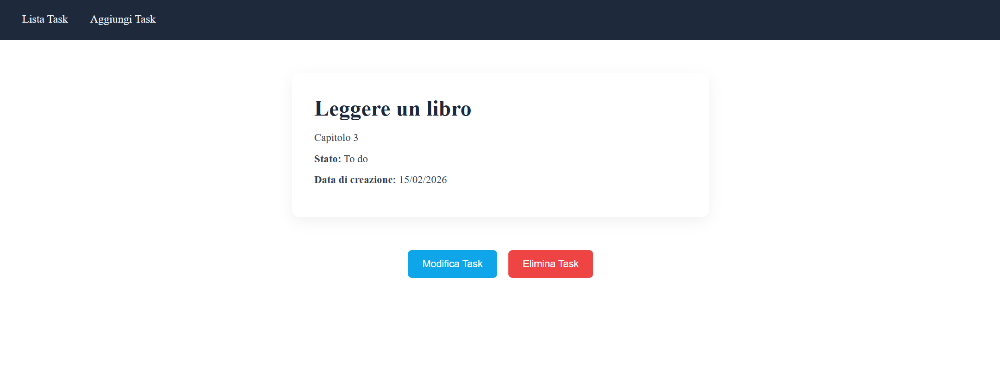
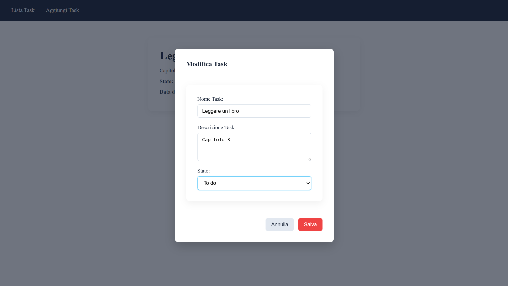
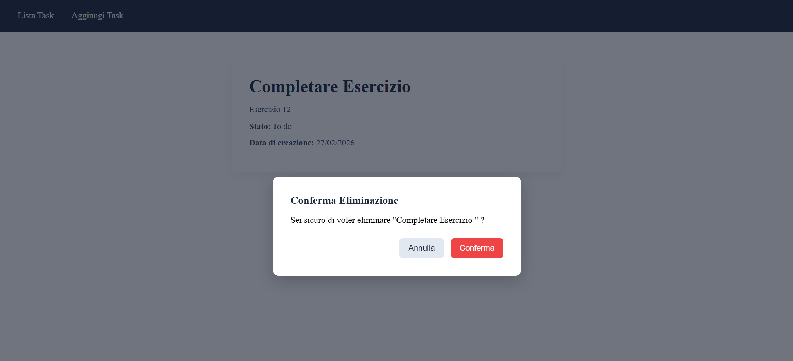

<h1 align="center">Task Manager</h1>

Applicazione sviluppata con **React + Vite** per la gestione di task tramite operazioni CRUD complete, con attenzione all’esperienza utente.


## Anteprima

### Lista Task


---

### Aggiunta Task


---

### Dettaglio Task


---

### Modifica Task (Modal)


---

### Elimina Task (Modal)


---

## Funzionalità Implementate

### 📌 Gestione Task (CRUD)

- Recupero task da API (`GET`)
- Creazione task (`POST`)
- Modifica task (`PUT`)
- Eliminazione task (`DELETE`)
- Stato globale gestito con **Context API**
- Logica centralizzata in un **custom hook `useTasks()`**

---

### 📌 Lista Task

- Visualizzazione in tabella
- Visualizzazione dettagliata del task al click
- Stato colorato dinamicamente
- Ottimizzazione del rendering della lista tramite `React.memo`
- Ordinamento tramite indicatore visivo ↑ ↓ sulla colonna attiva per:
  - Nome
  - Stato
  - Data di creazione

---

### 📌 Ricerca Ottimizzata

- Filtro case-insensitive per nome
- Debounce con `setTimeout`
- Memoizzazione della funzione con `useCallback`
- Ottimizzazione del ricalcolo con `useMemo`

---

### 📌 Modali Riutilizzabili

- Componente `Modal` generico con `createPortal`
- Conferma eliminazione task
- Modale di modifica con form controllato
- Gestione del submit della modale tramite `useRef`

---

## Tecnologie Utilizzate

- React
- React Router
- Vite
- Postman (test chiamate API)
- CSS

---

## 🚀 Avvio del Progetto

### Frontend
```bash
git clone https://github.com/Damiana-Arangio/task-manager.git
cd task-manager
npm install
npm run dev
```

### Backend
Il progetto utilizza un backend fornito da Boolean per la gestione delle API REST.

```bash
git clone https://github.com/boolean-it/react-task-manager-back
cd react-task-manager-back
npm install
npm run start
```